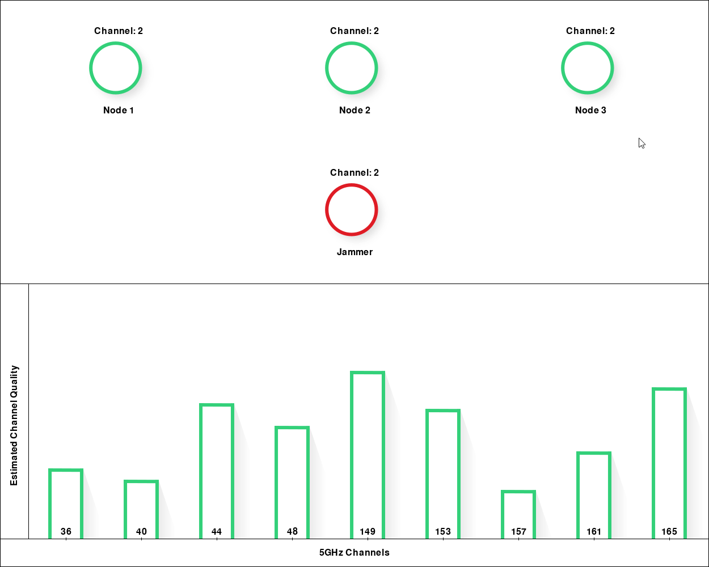

# Mesh Network Jamming Avoidance Demo UI

A `pygame` based user interface to showcase the capabilities of a Deep Learning (DL) approach for jamming detection and avoidance in mesh networks. This project visualizes the mesh
network status, including current channels and movements, as well as the DL channel quality estimator.

## Installation and Usage

1. Clone the repository:

   `git clone <repository_url>`
2. Install the required packages:

   `pip install -r requirements.txt`

3. Run the `main.py` file:
   `python main.py`

## UI Preview

